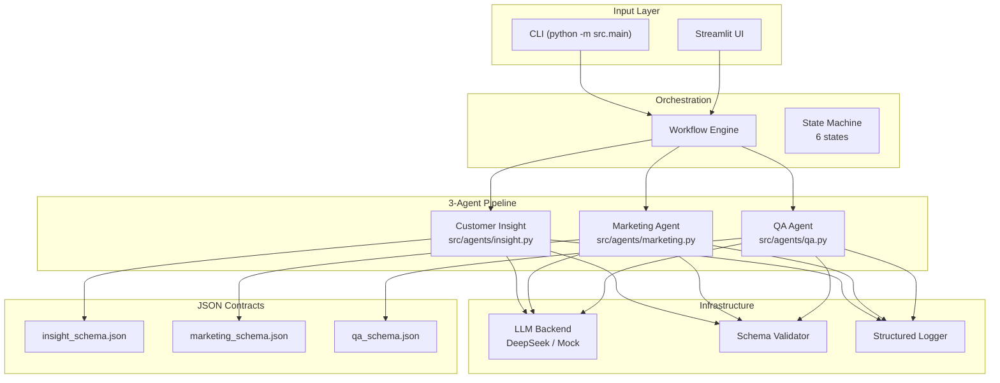
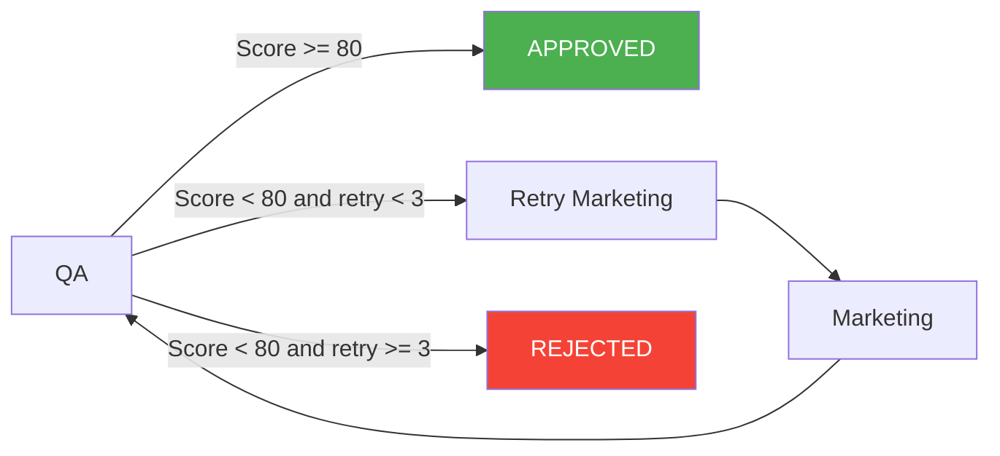
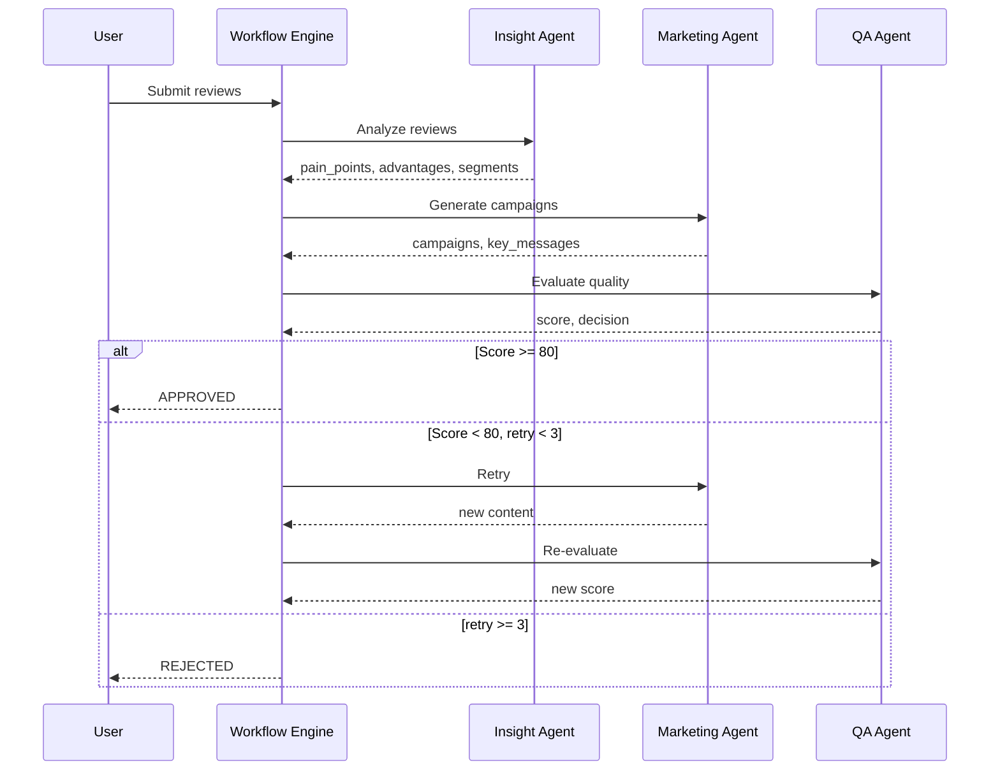

# Presentation Architecture

## System Architecture

```mermaid
graph TB
    subgraph Input["Input Layer"]
        CLI["CLI (python -m src.main)"]
        Streamlit["Streamlit UI"]
    end
    subgraph Orchestration["Orchestration"]
        Engine["Workflow Engine"]
        Graph["State Machine<br/>6 states"]
    end
    subgraph Agents["3-Agent Pipeline"]
        Insight["Customer Insight<br/>src/agents/insight.py"]
        Marketing["Marketing Agent<br/>src/agents/marketing.py"]
        QA["QA Agent<br/>src/agents/qa.py"]
    end
    subgraph Infrastructure["Infrastructure"]
        LLM["LLM Backend<br/>DeepSeek / Mock"]
        Validator["Schema Validator"]
        Logger["Structured Logger"]
    end
    subgraph Contracts["JSON Contracts"]
        S1["insight_schema.json"]
        S2["marketing_schema.json"]
        S3["qa_schema.json"]
    end
    CLI --> Engine
    Streamlit --> Engine
    Engine --> Insight
    Engine --> Marketing
    Engine --> QA
    Insight --> S1
    Marketing --> S2
    QA --> S3
    Insight --> LLM
    Marketing --> LLM
    QA --> LLM
    Insight --> Validator
    Marketing --> Validator
    QA --> Validator
    Insight --> Logger
    Marketing --> Logger
    QA --> Logger
```

## Retry Loop

```mermaid
graph LR
    QA -->|Score >= 80| APPROVED
    QA -->|Score < 80 and retry < 3| RETRY["Retry Marketing"]
    QA -->|Score < 80 and retry >= 3| REJECTED
    RETRY --> Marketing
    Marketing --> QA
    style APPROVED fill:#4caf50,color:#fff
    style REJECTED fill:#f44336,color:#fff
```

## Sequence Flow

```mermaid
sequenceDiagram
    participant U as User
    participant E as Workflow Engine
    participant I as Insight Agent
    participant M as Marketing Agent
    participant Q as QA Agent
    U->>E: Submit reviews
    E->>I: Analyze reviews
    I-->>E: pain_points, advantages, segments
    E->>M: Generate campaigns
    M-->>E: campaigns, key_messages
    E->>Q: Evaluate quality
    Q-->>E: score, decision
    alt Score >= 80
        E-->>U: APPROVED
    else Score < 80, retry < 3
        E->>M: Retry
        M-->>E: new content
        E->>Q: Re-evaluate
        Q-->>E: new score
    else retry >= 3
        E-->>U: REJECTED
    end
```
